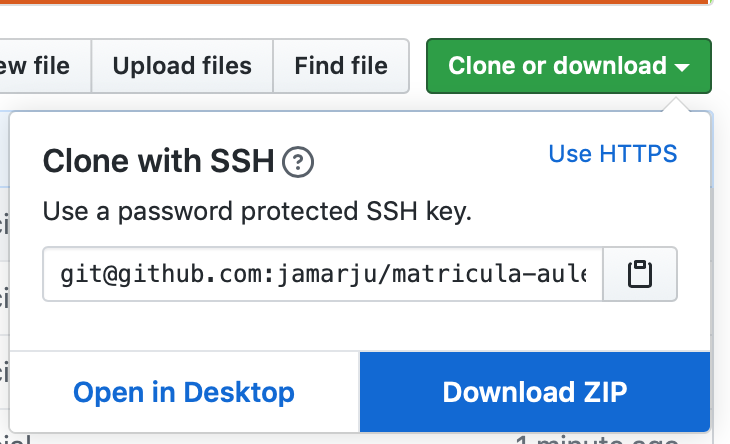
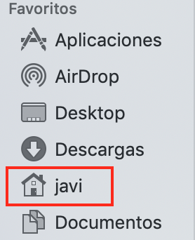
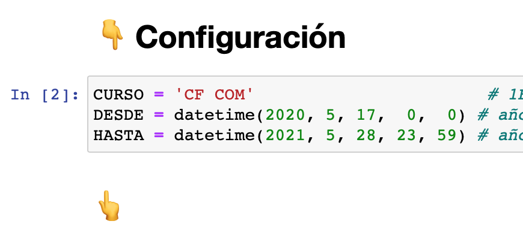

# Instalación

Instalar [miniconda](https://repo.anaconda.com/miniconda/Miniconda3-latest-MacOSX-x86_64.pkg).

Instalar [pdftk](https://www.pdflabs.com/tools/pdftk-the-pdf-toolkit/pdftk_server-2.02-mac_osx-10.11-setup.pkg). 

Descargar este repositorio:




Descomprimir el archivo.

Mover el directorio `matricula-aules-master` a la carpeta personal:



En un terminal:

```
conda create -n matricula python=3.7
conda activate matricula
conda install jupyter numpy pandas tqdm
pip install fdfgen
```

# Ejecución

En un terminal:

```
cd matricula-aules-master
./lanza.sh
```

# Configuración

1. Descargar los .csv de aules y colocarlos en sus carpetas correspondientes según el curso / ciclo: 1ESO, 2ESO, 3ESO, etc.

2. En la celda 2 configurar el curso / ciclo y fechas de matrícula a generar:


3. Ejecutar las celdas una a una con `⇧↩` controlando que ninguna dé error.

4. Si todo va bien, la salida de la última celda deberá parecerse a:


5. Para generar los PDF de otro curso, repetir desde el paso 2.

# Notas

- Sobre la versión de pdftk que no se cuelga: https://stackoverflow.com/questions/39750883/pdftk-hanging-on-macos-sierra

- Para ver los nombres de de los campos en un PDF y valores que aceptan los checkboxes (ej. Yes/Off): `pdftk fichero.pdf dump_data_fields`